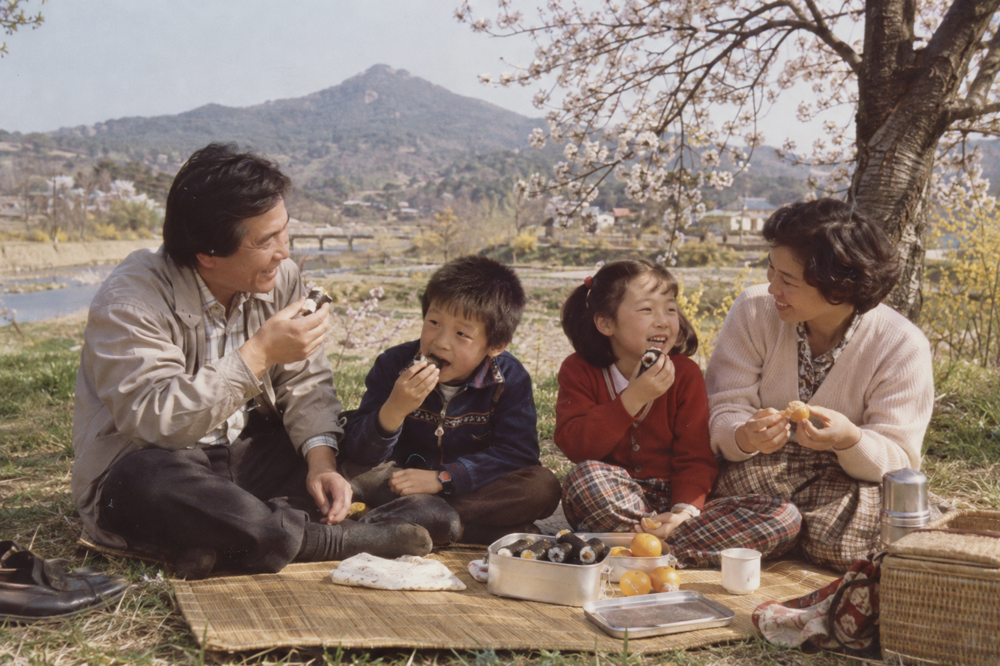

# 기억의 조각 · Mentor Memory Fragments

사진 한 장에서 시작해 한국어 인터뷰로 기억을 남기는 **로컬 우선 PWA 교육·멘토링 MVP**입니다. 확인한 이야기를 추억 엽서로 만들고, 원하면 원문을 바탕으로 회고록을 편집·승인합니다.



## 빠른 시작 — 모델 없이 텍스트 데모

Node.js 22, npm을 준비합니다.

```sh
git clone https://github.com/dontotl/mentor-memory-fragments.git
cd mentor-memory-fragments/memory-app
npm ci
npm run dev
```

- 소개·아키텍처·기술 고려사항: http://127.0.0.1:3000/project.html
- 샘플 시나리오: http://127.0.0.1:3000/preview
- 사진 업로드: http://127.0.0.1:3000/start
- STT/TTS 설정: http://127.0.0.1:3000/settings

미리보기에서 가상 사진을 선택하고 동의 후 **글로 답하기**로 진행하면 모델·마이크·유료 API 없이 흐름을 체험할 수 있습니다. 저장되는 데이터는 사용자의 로컬 서버에 생성됩니다.

## 구성

| 역할 | 구현 |
|---|---|
| 모바일 웹/PWA | Next.js 16, React 19, Konsta iOS |
| API·저장 | Next.js API, SQLite WAL, 로컬 사진 파일 |
| 선택적 로컬 STT | faster-whisper small CPU int8 |
| 선택적 로컬 TTS | Qwen3-TTS 0.6B CustomVoice, 한국어 Sohee |
| 선택적 로컬 언어 모델 | Ollama qwen3:4b |
| 선택적 외부 연동 | 설정에서 명시한 STT/TTS API, GPT Image API |

PWA는 웹을 앱처럼 사용하는 방식이며 React Native 바이너리가 아닙니다. 모델은 휴대폰 자체가 아니라 연결된 서버에서 실행됩니다. 녹음 종료 → 전사 → 사용자 확인 → 저장 → 다음 질문 순서이며 실시간 전이중 음성 대화를 구현한 것은 아닙니다.

## 로컬 음성 — 선택 설치

Python 3.11, 모델과 환경을 위한 디스크 여유 8 GB 이상이 필요합니다. 아래 설치는 인터넷에서 패키지를 받습니다. 모델은 앱 설정의 다운로드 버튼으로 별도로 내려받습니다.

```sh
cd memory-app # 저장소 루트에서 실행할 때
sh scripts/setup-speech.sh
.venv/bin/python -m uvicorn speech.service:app --host 127.0.0.1 --port 8765
```

[음성 설치·실측 기록](memory-app/speech/README.md)을 확인하세요. CPU TTS는 지연이 클 수 있습니다. 모델 가중치와 API 키는 이 저장소에 포함하지 않습니다. 외부 API는 명시적으로 설정·호출한 경우에만 사용하며 비용이 발생할 수 있습니다.

## 문서와 검증

- [제품 요구사항 정의서 (PRD)](docs/PRD.md): 목적·사용자 여정·요구사항·구성·데이터 처리·검증 범위·후속 과제
- [보안·데이터 주의사항](SECURITY.md)

```sh
cd memory-app
npm test
npm run test:guide
npm run guide:check
npm run typecheck
npm run build
npm start
```

브라우저 E2E는 Python Playwright와 Chromium을 별도 설치하고 앱 서버 실행 후 `python tests/e2e_project.py`, `python tests/e2e_demo.py`로 실행합니다. 합성 샘플 검사이며 실제 어르신 발화나 iPhone 마이크 검증을 대신하지 않습니다.

소개 페이지는 `memory-app/guide/project.template.html`이 원본입니다. `npm run guide:build`가 `docs/PRD.md`를 공개 다운로드와 HTML 전문에 동기화하며 일반 빌드에도 포함됩니다. Archify 생성 HTML은 후편집하지 않습니다. 외부 폰트 연결 차단은 Next.js의 HTTP CSP에 의존하므로 다이어그램은 로컬 HTTP 소개 링크에서 여세요. 내부 작업 지시·설계 과정·도구별 검증 산출물은 공개 문서에 포함하지 않습니다.

## 공개 범위

이 저장소는 **소스 코드 공개**이며, 서비스의 인터넷 호스팅 배포가 아닙니다. 서버는 기본적으로 루프백에만 바인딩됩니다. 공개 서비스 운영에는 인증, HTTPS, 백업·복구, 접근 제어 등 별도 설계가 필요합니다. 개인 사진·음성·API 키를 이슈나 PR에 올리지 마세요.

샘플 인물·사진은 AI로 만든 가상 자료입니다. 실제 사용자 데이터, SSH 키, DB, 모델 가중치, 개발 환경 및 상위 교육 자료의 Git 이력은 제외했습니다. 프로젝트 자체의 오픈소스 라이선스는 아직 지정하지 않았으며, 의존성·모델·도구는 각각의 라이선스를 확인해야 합니다.
